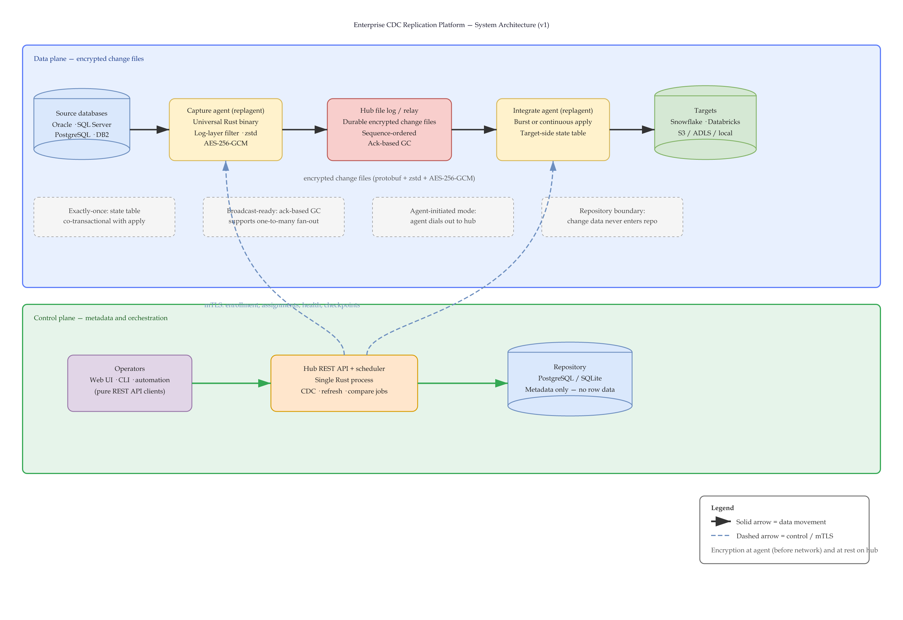
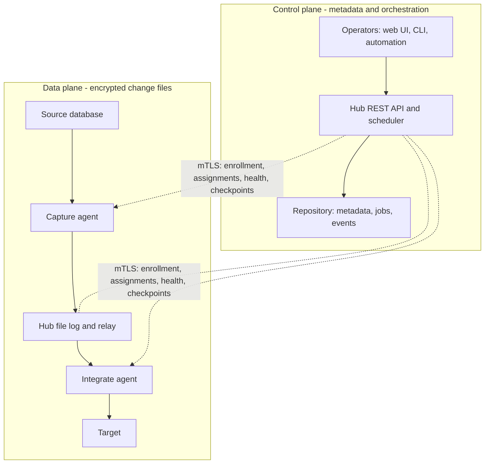

# Enterprise CDC Replication Platform — Design Documents

A ground-up enterprise data replication product competing with Fivetran HVR, Oracle GoldenGate, and Qlik Replicate. Rust-based capture and integrate agents, hub-routed native file log transport, log-based CDC from Oracle (direct redo, no LogMiner), SQL Server, PostgreSQL, and DB2 into Snowflake, Databricks, and file targets. Aimed at large regulated enterprises — defense, aerospace, manufacturing, finance — where air-gapped deployment, flat predictable licensing, and total documentation transparency are decisive.

## Executive overview

**For.** Data-platform, infrastructure, and security teams at large regulated enterprises - including defense, aerospace, manufacturing, and financial-services organizations - that need dependable database replication across segmented or air-gapped environments.

**Problem.** Existing CDC products can impose usage-based licensing, cloud dependencies, opaque internals, or network designs that are difficult to accredit. This platform is designed to provide log-based replication with predictable enterprise licensing, offline operation, and documentation detailed enough for operators and auditors to inspect how every change moves.

**v1 design scope.** A hub-routed platform with Rust capture and integrate agents, direct log-based capture from Oracle (without LogMiner), SQL Server, PostgreSQL, and DB2, and targets including Snowflake, Databricks, and file stores. It supports continuous CDC, scheduled refresh, and scheduled source-to-target comparison.

**Explicit non-goals for v1.** Active/active bidirectional replication, n-way replication, hub high availability, peer-to-peer routing, Kafka as core infrastructure, and AIX/Solaris agents are deferred. The platform is a replication product, not a general-purpose ETL or cloud-managed data-integration service.

**Current maturity.** This repository is in the design phase. It contains architecture and verification specifications; no product implementation is included here yet.

## v1 scope and connector status

These statuses describe **product planning**, not implementation readiness: **Committed** means the v1 design decision is locked; **In design** means the capability is intended for v1 but needs connector-level design and validation; **Deferred** means it is outside v1.

| Scope item | Status | Current boundary |
|---|---|---|
| Hub-routed core: universal agents, encrypted file log, REST API, scheduler, and repository | Committed | v1 core architecture and agent design are locked. |
| Continuous CDC, scheduled refresh, and scheduled compare | Committed | The three defined stream modes. |
| PostgreSQL source and PostgreSQL-to-PostgreSQL lab stream | Committed | The initial verification baseline and shared test environment. |
| Oracle source using direct redo, without LogMiner | In design | Intended for v1; capture access and client packaging still need connector validation. |
| SQL Server source | In design | Intended for v1; connector-specific design and lab coverage remain to be completed. |
| DB2 source | In design | Intended for v1; connector-specific design and lab coverage remain to be completed. |
| Snowflake target | In design | Intended for v1; the architecture defines the burst-apply model, but connector validation remains. |
| Databricks target | In design | Intended for v1; connector-specific design and lab coverage remain to be completed. |
| File targets: S3-compatible, ADLS, and local stores | In design | The replay/manifest guarantee is designed; each store's atomic-write capability must be validated. |
| Kafka target and transactional delivery | Deferred | A roadmap connector; not core infrastructure or an active v1 commitment. |
| Active/active bidirectional and n-way replication | Deferred | Bidirectional is planned for v2; n-way is deliberately demand-driven. |
| Hub high availability, peer-to-peer routing, and AIX/Solaris agents | Deferred | Documented future work or platform coverage outside v1. |

## Product principles

**Enterprise flat license.** One price for the whole enterprise. No stream counting, no row metering, no usage telemetry. Perpetual license plus annual maintenance; the software never stops working if maintenance lapses.

**Nothing hidden.** All documentation — concepts, internals, file formats, wire protocol, troubleshooting — public, unpaywalled, and mirrorable into air-gapped enclaves. The product's own sharp edges are documented openly and converted into guardrails wherever possible.

**Air-gap native.** Signed offline license files, no phone-home, agent-initiated connection mode, offline docs bundle, AI features optional and offline-tolerant.

**The product proves itself.** The built-in compare feature verifies source-equals-target in CI after every test run — the same mechanism customers use to trust the product gates every merge.

## Working copies

The canonical local home for this document set is `C:\Users\ryanr\OneDrive\Documents\repidata`, mirrored into the design workspace as `uploads/repidata/`. Documents live in `Documents/`; the interactive console prototype and its wireflows live at the folder root. OneDrive versioning keeps history; a Git repo in the same folder is the recommended upgrade.

## Console prototype & wireflows

The working UI is a single interactive prototype, `Replicator UI.dc.html`, covering: the grant-scoped tree (fleets → virtual fleets → grouped Connections/Streams, per-user colorization incl. custom colors and an on/off toggle); the Global Fleet console (KPI hero row, org-wide needs-triage strip with date/time stamps, triage-first fleet health matrix, org facts); the four-level log hierarchy (`<stream>.out` → `<vf>.vf.out` → `<fleet>.fleet.out` → `global.out`) in one viewer with docked/overlay modes, tabs, filters and follow/pause; the fleet timeline (per-VF triage rows — concerns/jobs/checks with clickable problems); connection detail with the expanded Server health panel (CPU/memory/IO bars, load, disk, network, sessions, advisory notes); stream detail, tables + column plan, activation, compare, jobs, events, alerts (rules, schedules, escalation, snooze/silence/blackout, delivery retry & backoff).

Wireflow diagrams (one per major flow): `global-fleet/Global Fleet Wireflow.dc.html`, `global-fleet/Global Admin Wireflow.dc.html`, `global-fleet/Users Permissions Wireflow.dc.html`, `fleet/virtual-fleet/streams/Activation Wireflow.dc.html`, `fleet/virtual-fleet/Alert Rules Wireflow.dc.html`, `fleet/virtual-fleet/streams/Add Table Wireflow.dc.html`, `fleet/virtual-fleet/streams/Tables Wireflow.dc.html`, `fleet/virtual-fleet/streams/Compare Data Wireflow.dc.html`, `fleet/virtual-fleet/streams/New Stream Wireflow.dc.html`.

## Shared test infrastructure

Every specification carries a phased Test Plan and numbered acceptance criteria; all of them draw on one shared harness: the Docker source lab (PostgreSQL 17 seeded from the existing pg17-lab environment, growing to Oracle Free 23ai, SQL Server, and DB2), HammerDB TPC-C workload generation, a chaos layer (process kills, network-namespace partitions), a virtual clock for scheduler determinism, credential-canary log sweeps, Playwright driving the real UI (doubling as the documentation screenshot stream), and compare-based end-to-end verification gating every merge alongside cargo test and cargo-deny.

## How verification works

Every specification follows the same four-link chain, and a concept is only "firm" when all four links exist:

1. **Design** — what the feature is and why (the body sections), with worked examples wherever behavior could surprise: the same DML materialized through each replication style, the ten-step first-activation walkthrough, the life of a single change from redo record to state-table commit, the life of a compare event. Nothing the user has to guess at.
2. **Test Plan** — a phased plan (focus, criteria, environment, entry and exit conditions per phase) plus the methods and harnesses that make the feature's claims falsifiable. Phases order initial verification; the full suite reruns as regression on every relevant merge.
3. **Test Procedures** — executable, step-by-step instructions: preconditions, numbered steps, expected results, and the evidence to archive. Anyone on the team can run a procedure and reach the same verdict; nothing depends on the author's memory.
4. **Acceptance Criteria** — the numbered pass/fail rows (ARC/TOP/LOC/AGT/SCH/SLC/CHA/REF/CMP/JOB-xx) that feed the master traceability matrix.

The working rule: **a criterion is checked off only when its procedure has been executed, every expected result observed, and the listed evidence archived in the run record.** No procedure, no pass. Evidence (transcripts, compare reports, packet captures, audit-log excerpts) lives with the release record so any pass can be re-audited later — the same discipline an ATO package demands, applied to our own product.

Two procedures deliberately double as documentation validation: the onebox quick-start (AGT-09) executes the published tutorial verbatim, and the topology-view procedure (TOP-07) generates the documentation screenshots — so docs that drift from reality fail tests, honoring the transparency promise mechanically rather than aspirationally.

## Architecture at a glance

Editable source: [`diagrams/system-architecture.drawio`](diagrams/system-architecture.drawio) (draw.io) · Vector export: [`diagrams/system-architecture.svg`](diagrams/system-architecture.svg)

Regenerate assets: `python diagrams/generate_system_architecture.py`

Control plane: hub server (REST API, scheduler, file relay) with a PostgreSQL repository (SQLite for dev/lab), logical multi-hub, web UI as a pure client of the public OpenAPI-documented REST API, standalone static CLI binary. Data plane: one universal Rust agent binary (all sources and targets; role assigned per job), hub-routed native file log transport (protobuf frames, zstd, AES-256-GCM, ack-based GC, change-origin markers), exactly-once via target-side state tables. Stream modes: continuous CDC, scheduled full refresh, and CDC plus scheduled compare.

## Published and planned documentation

The table includes both published files and named planned specifications. **An entry marked Planned is not yet published in this repository**; it is a tracked documentation gap, not a file a reader can open. The master traceability matrix is likewise not yet assembled; it is a future consolidation artifact, not a file in this repository.

| Document | Status |
|---|---|
| `README.md` — this overview | Living |
| `architecture.md` — components, life of a single change, transport commitments, security, licensing, HVR mapping | Design locked for v1 core |
| `replication-topologies.md` — six topologies with verdicts, origin-marker requirement, bidirectional design outline | v1 verdicts locked; bidirectional design pass in v2 |
| `../fleet/virtual-fleet/connections/connection.md` — location model, capability matrix, agent/agentless reachability, credentials, validation | v1 design |
| `agent.md` — universal binary, enrollment, mTLS, spool, orchestrated upgrades, platform matrix | v1 design locked |
| `scheduler.md` — job model and states, three stream modes, cron/calendars/overlap, refresh mechanics | v1 design locked |
| `slicing-design.md` — slicing types, Advisor, AI layer, slice map, acceptance criteria | Design complete; implementation phased (v1 basics + restartability, Advisor and slice map in milestone 2) |
| `stream.md` — stream model, location groups, table groups, identity vs physical names, structured settings, replication styles, keys, lifecycle, plan-based activation | v1 design — reference spec for the set |
| `refresh.md` — bulk and row-wise refresh, snapshot guarantee, online handshake, scope and repair | v1 design |
| `compare.md` — bulk/row-wise/composed compare, canonicalization, online algorithm, sync report, direct file compare | v1 design — the trust mechanism |
| `../fleet/virtual-fleet/streams/compare-ui.md` — the console compare surface: the setup dialog (scope, method tiers, online modes, class filters, restrict, CLI parity), the ~3–4 min running job with per-table progress, the slice-level deep-analysis drill-in, the background lifecycle (notice chip, expanded Jobs rows, CURRENT→DONE event handoff), the results report, and repair (direction, classes, restrict WHERE, SQL preview) | v1 design — prototyped in `Replicator UI.dc.html`, wireflow in `fleet/virtual-fleet/streams/Compare Data Wireflow.dc.html` |
| `../fleet/virtual-fleet/streams/activation-ui.md` — plan-based Activate replication: activation precedes refresh (the chained initial load off the activation snapshot), table-scoped activation, the five capture-start modes, target-table policy, start policy, and the stream log panel | v1 design — prototyped in `Replicator UI.dc.html`, wireflow in `fleet/virtual-fleet/streams/Activation Wireflow.dc.html` |
| `../fleet/virtual-fleet/alerts-ui.md` — the alerts surface: Stream/Fleet Alerts, acknowledge≠dismiss, alert rules (one notification type per rule), schedule & recurrence (manager cycle / own interval / daily digest), test & preview, hub-health thresholds, snooze/silence/maintenance blackouts, escalation tiers, delivery retry & backoff (transient vs permanent, durable `<rule>.pending` queue, delivery-failure alerts with loop guard), and the alert logs | v1 design — prototyped in `Replicator UI.dc.html`, wireflow in `fleet/virtual-fleet/Alert Rules Wireflow.dc.html` |
| `../fleet/virtual-fleet/run-history.md` — compare and refresh run history at stream and fleet scope, deep-linking into Events | v1 design — prototyped in `Replicator UI.dc.html` |
| `jobs.md` — job entity, rationalized state machine, event-driven long tasks, run logs, job settings | v1 design |
| `events.md` — the audit ledger: completeness by construction, unified timeline, immutability, SIEM forwarding | v1 design |
| `tables.md` — the fleet-wide table surface: per-table verified-status model (incl. the honest INCONCLUSIVE), definition drift check, adopt-from-actual as a plan, table-scoped operations | v1 design — written in the locked naming |
| `../fleet/virtual-fleet/streams/tables-ui.md` — the Tables console surface: list + detail screens, column editor, DDL panes, stop-then-remove, state and persistence | v1 design — prototyped in `Replicator UI.dc.html`, wireflow in `fleet/virtual-fleet/streams/Tables Wireflow.dc.html` |
| `../fleet/virtual-fleet/streams/stream-ui.md` — the Stream page: three-stage strip, latency panel, per-table state, plus the **Add table** flow (catalogue → pick → review, flag guardrails, registration is a definition change never a data copy) and **Duplicate** (shared source connection, independent position/jobs/state, derived-not-stored metrics), and the suspend/deactivate/retire ladder | v1 design — prototyped in `Replicator UI.dc.html`, wireflow in `fleet/virtual-fleet/streams/Stream Wireflow.dc.html` |
| `../global-fleet/users-permissions-ui.md` — the Admin Users/Permissions split (accounts vs one-row-per-grant-attachment), the three admin levels with strictly-downward editing and 🔒 out-of-scope rows, user actions (edit, credential reset, enable/disable-revokes-nothing), the Add access flow, and the full repository + hub permission tiers | v1 design — prototyped in `Replicator UI.dc.html`, wireflow in `global-fleet/Users Permissions Wireflow.dc.html` |
| `../global-fleet/global-fleet-ui.md` — the Global Fleet console as its own surface: FleetViewer gate + grant-scoped visibility, the Overview → Attention Areas → Action Zone layering (KPI hero row, org-wide needs-triage strip with date/time + deterministic ordering + deep links, triage-first fleet health matrix with expandable VF tables), org facts, the global log, and the read-only-across-systems contract | v1 design — prototyped in `Replicator UI.dc.html`, wireflow in `global-fleet/Global Fleet Wireflow.dc.html` |
| `fleet-hierarchy.md` — the four-level hierarchy (Global Fleet → Fleet → Virtual Fleet → Stream), the Global Fleet console (the cross-hub-server view HVR never had, gated by `FleetViewer`; KPI hero row, org-wide needs-triage strip, triage-first fleet health matrix, global log, org facts; searchable/pinnable, built for hundreds of fleets), the four-level log hierarchy (stream → VF → fleet → global), the strictly downward-editing admin model (SuperAdmin / Global / Fleet / Virtual Fleet Admin), the Users-vs-Permissions split (accounts vs one-row-per-attachment access control, both grant-scoped and column-sortable), self-service profile editing (persisted per account), per-user × per-fleet environment theming (color-coded banners, tree colorization with custom colors, prompt-guarded renaming, production-forced dark mode, per-user persistence), and the sign-in/session model (email-based sign-in with no usernames, scope-based landing on the highest granted level, persistent sessions, local user creation and editing with starter grants, per-user resizable sidebar), and the stream Connections view (specified in full in `connection.md`) | v1 design — prototyped in `Replicator UI.dc.html` |
| `../fleet/virtual-fleet/timeline.md` — operational timelines at stream, virtual-fleet, and fleet scope: history bands (throughput, capture position lag, checkpoint lag, file-log backlog), event markers with a scrub cursor and dominant-factor diagnosis, infrastructure health (source agent / hub / repo database / target agent with CPU, memory, IO — wobble-free concern thresholds at CPU/mem > 80%, IO > 320 MB/s), per-table flow-by-hour profiles, the fleet-timeline triage rows, and the activate/deactivate what-if preview | v1 design — prototyped in `Replicator UI.dc.html` |
| `../fleet/virtual-fleet/connections/connection.md` — the operator-facing connection surface: the sortable/filterable connections table with per-user column sets, connection detail (agent vs agentless, database connection, resolved properties, stream membership as blast radius, the expanded Server health panel — CPU/memory/IO bars, load average, log-staging disk, network, process, sessions, advisory notes), the agent / database / source-and-target-properties dialogs, and the test-before-save contract | v1 design — prototyped in `Replicator UI.dc.html` |
| `security-architecture.md` — final planned concept | Planned |
| `sizing.md` — the environment-sizing model: hub storage inventory, compute distribution, tier table, quota formulas; implemented by the Replication_Scope calculator (golden-vector contract) | v1 design — backs ARC-13's published-sizing-guidance gate |
| `filesystem-layout.md` — the on-disk contract: verifiably immutable install, fully enumerated state tree with backup classes, designed-out directories proven absent | v1 design |
| `fleet-paths.md` — the path model: the console tree on disk, why Global Fleet and Global Admin have no disk presence, enrollment ids never display names, which VF children are directories, and the log hierarchy as the path hierarchy | v1 design |
| `naming.md` — terminology decisions: HVR coinages renamed (stream, connection, history style, apply, segments…), industry-generic terms kept, banned-terms CI lint (NAM-01) | Locked for location→connection and stream→stream; rename sweep pending final sign-off on the rest |
| `master-traceability-matrix.md` — the authoritative acceptance-criteria register: every STR/LOC/CON/…/GFC/FLC/VFC/JBS/EVU/STU/TML/HPT row with procedure, state, and evidence | Baselined; no runs recorded |
| `diagrams/diagram-plan.md` — one wire diagram per concept: the enforced inventory (type, required elements, owning section, status) with Lucid links for completed diagrams | Living — a concept without its diagram is incomplete |
| `ddl-capture.md` - planned source-DDL detection and decoding specification; required before DDL policy verification | Planned |
| master-traceability-matrix.md - consolidated acceptance criteria, procedures, verification state, and evidence references | Baselined 2026-07-12; 173 criteria (FLT-12..18 added 2026-07-16, FLT-19..23 on 2026-07-17, FLT-24..25 on 2026-07-18, FLT-26..28 on 2026-07-21, CON-01..09 and FLT-29..31 and CON-10..14 on 2026-07-26), all not yet run or gated/deferred |

## Scope source of truth

Product scope is maintained on the interactive review board (v6, thirteen sections: core architecture, agents, topologies, scheduler and refresh modes, hub components, interfaces, licensing, Oracle capture, source/target connectors, UI screens, testing, documentation — with slicing joining as the fourteenth). The master architecture document is drafted from the exact selections submitted from that board; nothing enters scope by assumption.
